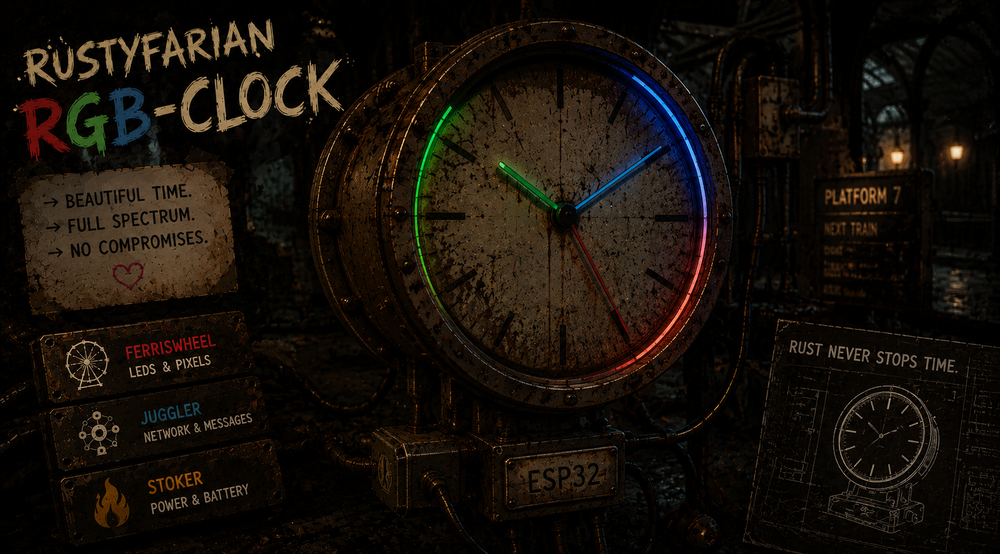

# ESP32 C6 RGB Clock

<p>
  
</p>

[](https://github.com/datenkollektiv/rustyfarian-rgb-clock/actions/workflows/rust.yml)
[](LICENSE)
[](https://github.com/esp-rs/rust)
[](https://github.com/datenkollektiv/rustyfarian-rgb-clock/actions/workflows/fmt.yml)
[](https://github.com/datenkollektiv/rustyfarian-rgb-clock/actions/workflows/audit.yml)

An ESP32-C6 RGB LED clock that displays time using 12 WS2812 NeoPixel LEDs arranged in a clock face. Time is received via MQTT from an external source.

> Note: Parts of this library were developed with the assistance of AI tools.
> All generated code has been reviewed and curated by the maintainer.

## Vision

> Validate a replicable three-tier embedded testing pyramid (host tests, Wokwi simulation, hardware-in-the-loop) using a working RGB clock as the test fixture, so that future rustyfarian projects can adopt the approach with confidence.

**We are building this for:** ourselves — learning and preparation for future embedded Rust projects and for future rustyfarian projects that will inherit this testing approach.

**Long-term goals:**
- All three testing tiers running green in CI
- Documentation is good enough to replicate the testing pyramid in new projects
- Mature the shared rustyfarian crates through real usage and test coverage

**Out of scope:** new clock features (those belong in other projects), hardware compatibility beyond ESP32-C6, and building a general-purpose testing framework.

*Full vision, success signals, and open questions: [VISION.md](./VISION.md)*

## Hardware

| Signal                   | ESP32-C6 pin | ESP32-C3 pin |
|:-------------------------|:-------------|:-------------|
| WS2812 clock ring (DIN)  | **GPIO 10**  | **GPIO 10**  |
| Onboard RGB LED          | GPIO 8       | GPIO 8       |

Pin assignments live in `src/main.rs`.

## Quick Start

Build for ESP32-C6 (default)

```sh
just build
```

Build for ESP32-C3

```sh
just build idf_c3_rgb_clock
```

Flash and open monitor (ESP32-C6 default)

```sh
just run
just monitor
```

Flash or run for ESP32-C3

```sh
just flash idf_c3_rgb_clock
just run idf_c3_rgb_clock
```

Port auto-detection in `scripts/detect-port.sh` works on macOS and Linux.
On Windows, set `ESPFLASH_PORT` before flashing:

```sh
ESPFLASH_PORT=COM3 just flash
```

Run all pre-commit checks (format, check, clippy, test)

```sh
just verify
```

Wi-Fi and MQTT credentials are provisioned at runtime via a SoftAP captive portal — no `.env` is needed.
On first boot (or after `just erase-flash`) the clock ring pulses amber and the device hosts an open `Rustyfarian-XXXX` access point; connect to it, open the captive portal, and submit your Wi-Fi + MQTT details.
See [docs/features/wifi-softap-provisioning-v1.md](docs/features/wifi-softap-provisioning-v1.md) for details.
Run `just setup-cargo-config` to create `.cargo/config.toml` from the template.

### Reprovisioning & recovery

To change credentials — or recover from a mistyped password, a broker change, or a renamed/vanished
Wi-Fi network — clear the stored config and reboot back into the portal:

```sh
just erase-flash
```

Then power-cycle the device, join the open `Rustyfarian-XXXX` access point, open the captive portal, and
submit the new Wi-Fi + MQTT details.
This requires host tooling and a cable today; a cable-free BOOT-button trigger is a planned follow-up.

The provisioning AP is **open (no password)** by default — a conscious tradeoff for local, physical,
first-boot setup, not a convenience default.
It is reachable only while the device is unprovisioned and is never exposed over the joined network.
See the [threat model](docs/features/wifi-softap-provisioning-v1.md#security-stance--threat-model) for the
accepted residual risk and the WPA2 hardening path.

## MQTT Time Format

The clock subscribes to the `tick` topic and expects JSON messages:

```json
{"hour": 14, "minute": 23, "second": 45}
```

Example using mosquitto_pub:

```sh
mosquitto_pub -h <MQTT_HOST> -t tick -m '{"hour":14,"minute":23,"second":45}'
```

Fields:
- `hour`: 0-23 (24-hour format, mapped to 12 positions)
- `minute`: 0-59 (mapped to 12 positions)
- `second`: 0-59 (mapped to 12 positions)

Since the default flash size of 1MB may not be enough, `just flash` uses a custom partition table.
The underlying command is:

```sh
cargo espflash flash --partition-table partitions.csv
```

## Dependencies

This project uses external crates from companion repositories:

| Crate                        | Repository                                                                   | Description                           |
|:-----------------------------|:-----------------------------------------------------------------------------|:--------------------------------------|
| `ferriswheel`                | [rustyfarian-ws2812](https://github.com/datenkollektiv/rustyfarian-ws2812)   | RGB ring effects (rainbow animations) |
| `rustyfarian-esp-idf-ws2812` | [rustyfarian-ws2812](https://github.com/datenkollektiv/rustyfarian-ws2812)   | ESP-IDF RMT driver for WS2812         |
| `rustyfarian-esp-idf-wifi`   | [rustyfarian-network](https://github.com/datenkollektiv/rustyfarian-network) | WiFi connection management            |
| `rustyfarian-esp-idf-mqtt`   | [rustyfarian-network](https://github.com/datenkollektiv/rustyfarian-network) | MQTT client with callbacks            |

## Project Structure

```text
rustyfarian-rgb-clock/           # This repository
├── src/                         # Application code
│   ├── main.rs                  # Entry point, Wi-Fi/MQTT setup
│   └── rgb_clock.rs             # Clock display logic
└── crates/
    └── clock-pure/              # Pure Rust clock utilities (testable)
```

### Local Development

For developing alongside the external crates, `.cargo/config.toml` contains `[patch]` sections that redirect git dependencies to sibling directories:

```toml
[patch."https://github.com/datenkollektiv/rustyfarian-ws2812"]
ferriswheel = { path = "../rustyfarian-ws2812/crates/ferriswheel" }
rustyfarian-esp-idf-ws2812 = { path = "../rustyfarian-ws2812/crates/rustyfarian-esp-idf-ws2812" }

[patch."https://github.com/datenkollektiv/rustyfarian-network"]
rustyfarian-esp-idf-wifi = { path = "../rustyfarian-network/crates/rustyfarian-esp-idf-wifi" }
rustyfarian-esp-idf-mqtt = { path = "../rustyfarian-network/crates/rustyfarian-esp-idf-mqtt" }
```

Comment out the patches to build against the published GitHub repos.

## License

MIT
