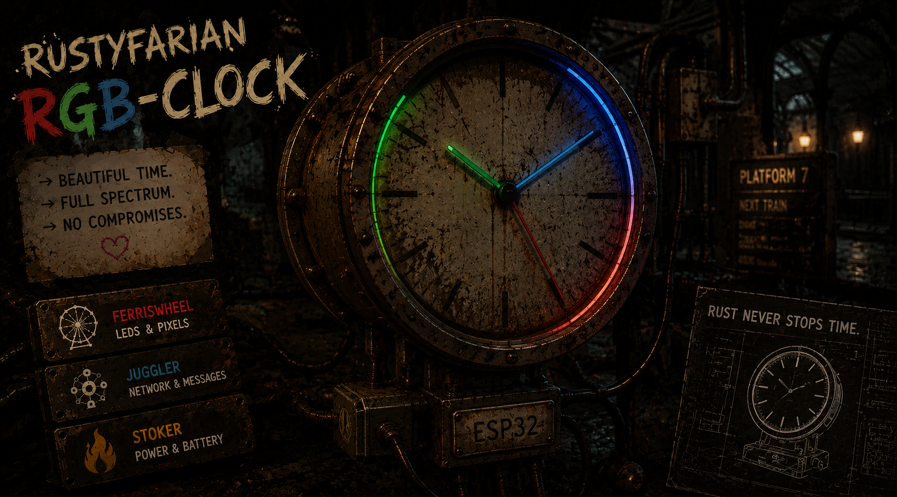

# ESP32 C6 RGB Clock

<p>
  
</p>

[](https://github.com/datenkollektiv/rustyfarian-rgb-clock/actions/workflows/rust.yml)
[](LICENSE)
[](https://github.com/esp-rs/rust)
[](https://github.com/datenkollektiv/rustyfarian-rgb-clock/actions/workflows/fmt.yml)
[](https://github.com/datenkollektiv/rustyfarian-rgb-clock/actions/workflows/audit.yml)

An ESP32-C6 RGB LED clock that displays time using 12 WS2812 NeoPixel LEDs arranged in a clock face. Time is received via MQTT from an external source.

> Note: Parts of this library were developed with the assistance of AI tools.
> All generated code has been reviewed and curated by the maintainer.

## Vision

> Validate a replicable three-tier embedded testing pyramid (host tests, Wokwi simulation, hardware-in-the-loop) using a working RGB clock as the test fixture, so that future rustyfarian projects can adopt the approach with confidence.

**We are building this for:** ourselves — learning and preparation for future embedded Rust projects and for future rustyfarian projects that will inherit this testing approach.

**Long-term goals:**
- All three testing tiers running green in CI
- Documentation is good enough to replicate the testing pyramid in new projects
- Mature the shared rustyfarian crates through real usage and test coverage

**Out of scope:** new clock features (those belong in other projects), hardware compatibility beyond ESP32-C6, and building a general-purpose testing framework.

*Full vision, success signals, and open questions: [VISION.md](./VISION.md)*

## Hardware

| Signal                   | ESP32-C6 pin | ESP32-C3 pin |
|:-------------------------|:-------------|:-------------|
| WS2812 clock ring (DIN)  | **GPIO 10**  | **GPIO 10**  |
| Onboard RGB LED          | GPIO 8       | GPIO 8       |

Pin assignments live in `src/main.rs`.

## Quick Start

Build for ESP32-C6 (default)

```sh
just build
```

Build for ESP32-C3

```sh
just build idf_c3_rgb_clock
```

Flash and open monitor (ESP32-C6 default)

```sh
just run
just monitor
```

Flash or run for ESP32-C3

```sh
just flash idf_c3_rgb_clock
just run idf_c3_rgb_clock
```

Port auto-detection in `scripts/detect-port.sh` works on macOS and Linux.
On Windows, set `ESPFLASH_PORT` before flashing:

```sh
ESPFLASH_PORT=COM3 just flash
```

Run all pre-commit checks (partition table, format, check, clippy, test)

```sh
just verify
```

The partition checks run first because they are the cheapest and guard the most expensive mistake.
`just partition-check` validates `partitions.csv` against the rules ESP-IDF enforces only at flash time — 64 KiB alignment for app partitions, exact `type/subtype` pairs, `otadata` sized to two sectors, no overlaps, slots large enough for the image, and `nvs` still at its original offset so provisioned credentials survive.
`just partition-check-tests` runs a 12-case regression suite over the fixtures in `scripts/partition-fixtures/`, asserting that each way a table can be wrong is still rejected with the right diagnostic.
Both also run in CI.

Wi-Fi and MQTT credentials are provisioned at runtime via a SoftAP captive portal — no credentials live in the firmware image.
A `.env` is optional: it only supplies **non-secret** defaults that pre-fill the portal form (see `.env.example`); passwords are never set there.
On first boot (or after `just erase-flash`) the clock ring pulses amber and the device hosts an open `Rustyfarian-XXXX` access point; connect to it, open the captive portal, and submit your Wi-Fi + MQTT details.
See [docs/features/wifi-softap-provisioning-v1.md](docs/features/wifi-softap-provisioning-v1.md) for details.
Run `just setup-cargo-config` to create `.cargo/config.toml` from the template.

### Reprovisioning & recovery

To change credentials — or recover from a mistyped password, a broker change, or a renamed/vanished
Wi-Fi network — clear the stored config and reboot back into the portal:

```sh
just erase-flash
```

Then power-cycle the device, join the open `Rustyfarian-XXXX` access point, open the captive portal, and
submit the new Wi-Fi + MQTT details.
This requires host tooling and a cable today; a cable-free BOOT-button trigger is a planned follow-up.

The provisioning AP is **open (no password)** by default — a conscious tradeoff for local, physical,
first-boot setup, not a convenience default.
It is reachable only while the device is unprovisioned and is never exposed over the joined network.
See the [threat model](docs/features/wifi-softap-provisioning-v1.md#security-stance--threat-model) for the
accepted residual risk and the WPA2 hardening path.

## MQTT Time Format

The clock subscribes to the `tick` topic and expects JSON messages:

```json
{"hour": 14, "minute": 23, "second": 45}
```

Example using mosquitto_pub:

```sh
mosquitto_pub -h <MQTT_HOST> -t tick -m '{"hour":14,"minute":23,"second":45}'
```

Fields:
- `hour`: 0-23 (24-hour format, mapped to 12 positions)
- `minute`: 0-59 (mapped to 12 positions)
- `second`: 0-59 (mapped to 12 positions)

## Firmware layout and flashing

The 4 MiB flash carries an A/B OTA layout — `ota_0` and `ota_1` at 1.75 MiB each, plus `otadata`, `nvs` and `phy_init` — so a future update can be written to the inactive slot while the running one keeps the clock alive.
`partitions.csv` is the source of truth and is validated by `just partition-check`.
That check covers the table's geometry only; `just image-check` generates the exact app image with `espflash save-image` and fails if it does not fit both slots, which is the check that tracks firmware growth.
The generated image stays at `tmp/<target>-app.bin` for inspection; it is overwritten on every run, one file per target, and `tmp/` is ignored by git.
`just partition-check` needs bash 4 or newer: macOS ships 3.2, so run `brew install bash` and make sure `/usr/bin/env bash` resolves to it (`just doctor` shows which one is on `PATH`).

`just flash` builds first, then flashes the application together with the bootloader that `esp-idf-sys` built from this project's `sdkconfig.defaults`:

```sh
just flash
just monitor
```

Passing that bootloader explicitly is not optional.
espflash bundles its own ESP-IDF v5.5.1 bootloader and writes that one unless told otherwise, which both mismatches this project's v5.3.3 app (32 KiB versus 64 KiB MMU pages) and silently discards every bootloader setting configured here — `CONFIG_BOOTLOADER_APP_ROLLBACK_ENABLE=y` above all, without which OTA rollback is inert while `mark_valid()` still reports success.
`scripts/preflight.sh` therefore builds, resolves exactly one bootloader, and refuses to continue unless rollback is compiled into that specific binary.
It also runs the image-size check above, so a build that outgrew its slot never reaches the device.
`scripts/preflight.sh` also validates `partitions.csv` first, so the normal `just flash` path cannot skip the table checks that `just flash-baseline` declares as a recipe dependency.
`just bootloader-path` prints the one it would use; pass the target for the C3 (`just bootloader-path idf_c3_rgb_clock`).

Flashing needs exactly one serial port, either the single USB device found by `scripts/detect-port.sh` or an explicit `ESPFLASH_PORT`.
Because `--ignore-app-descriptor` turns off espflash's own chip-model check, `scripts/flash-image.sh` asks the attached chip what it is with `espflash board-info` and refuses when the answer differs from the requested target, so a C6 image cannot land on an attached C3.
`DRY_RUN=1 just flash` or `DRY_RUN=1 just flash-baseline` prints every device-touching command in order without running any of them.

Changing the partition layout needs a full erase, because the bytes that become `otadata` previously held application data the bootloader would misread as slot state:

```sh
ESPFLASH_PORT=/dev/cu.usbmodem1101 just flash-baseline
```

This builds and validates **before** erasing, so a compile error cannot leave a wiped device with nothing to flash onto it.
It pins one serial port across both the erase and the flash, refuses to start when no unique port is detected, and requires typing `ERASE` to confirm.
The erase clears `nvs` as well, so the device must be re-provisioned over SoftAP afterwards.

## Dependencies

This project uses external crates from companion repositories:

All of them are consumed from crates.io; this repository has no git dependencies.

| Crate                         | Version | Repository                                                                   | Description                               |
|:------------------------------|:--------|:-----------------------------------------------------------------------------|:------------------------------------------|
| `ferriswheel`                 | 0.7.0   | [rustyfarian-ws2812](https://github.com/datenkollektiv/rustyfarian-ws2812)   | RGB ring effects (rainbow animations)     |
| `rustyfarian-esp-idf-ws2812`  | 0.7.0   | [rustyfarian-ws2812](https://github.com/datenkollektiv/rustyfarian-ws2812)   | ESP-IDF RMT driver for WS2812             |
| `rustyfarian-esp-idf-network` | 0.5.0   | [rustyfarian-network](https://github.com/datenkollektiv/rustyfarian-network) | Wi-Fi, MQTT, SoftAP provisioning, and OTA |

The separate `rustyfarian-esp-idf-wifi` and `rustyfarian-esp-idf-mqtt` crates were consolidated upstream into `rustyfarian-esp-idf-network`, whose features this firmware enables explicitly (`wifi`, `mqtt`, `provisioning`, `ota`).

## Project Structure

```text
rustyfarian-rgb-clock/           # This repository
├── src/                         # Application code
│   ├── main.rs                  # Entry point, provisioning and Wi-Fi/MQTT setup
│   └── rgb_clock.rs             # Clock display logic
├── crates/
│   └── clock-pure/              # Pure Rust clock utilities (host-testable)
├── partitions.csv               # A/B OTA flash layout (validated by just partition-check)
├── sdkconfig.defaults           # ESP-IDF settings, incl. bootloader rollback
└── scripts/                     # just recipe implementations
    ├── preflight.sh             # Build and validate before any flash
    ├── flash.sh                 # Build, then flash via flash-image.sh
    ├── flash-image.sh           # Flash-only step (no build, no validation)
    ├── check-partitions.sh      # Partition table validator
    └── partition-fixtures/      # Fixtures for the validator's regression suite
```

### Local Development

For developing alongside the external crates, `.cargo/config.toml` can redirect them to sibling working trees.
Every dependency now resolves from crates.io, so the patches belong under the `crates-io` key:

```toml
[patch.crates-io]
bunting = { path = "../rustyfarian-ws2812/crates/bunting" }
pennant = { path = "../rustyfarian-ws2812/crates/pennant" }
ferriswheel = { path = "../rustyfarian-ws2812/crates/ferriswheel" }
rustyfarian-esp-idf-ws2812 = { path = "../rustyfarian-ws2812/crates/rustyfarian-esp-idf-ws2812" }
rustyfarian-esp-idf-network = { path = "../rustyfarian-network/crates/rustyfarian-esp-idf-network" }
```

Cargo keys `[patch]` sections by dependency source, so a leftover `[patch."https://github.com/..."]` section silently stops applying once a crate moves to crates.io — builds quietly use the published version and only a "patch was not used in the crate graph" warning hints at it.
Leave the network entry out while verifying a release, or a local-only fix will mask a gap in the published crate.

Comment out the patches to build against the published GitHub repos.

## License

MIT
