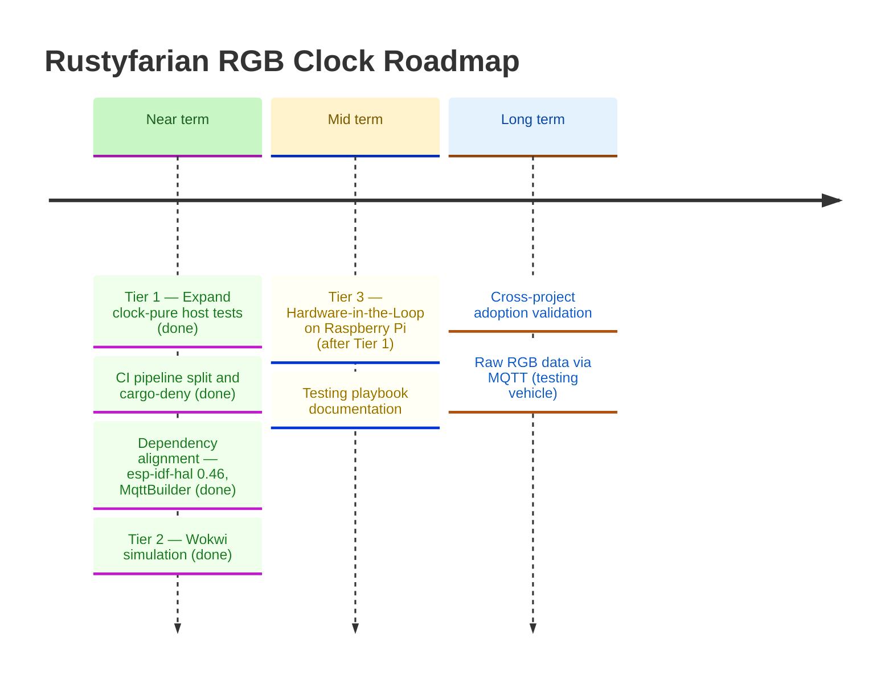

# Roadmap

*Last updated: March 2026*

This project validates a three-tier embedded testing pyramid for the rustyfarian ecosystem.
The RGB clock is a stable test fixture — feature work lives in other projects.
Following a vision review (March 2026), the focus is on completing all three testing tiers
with documentation good enough for other projects to adopt the approach.

See [testing-strategy.md](testing-strategy.md) for the full three-tier implementation plan.
