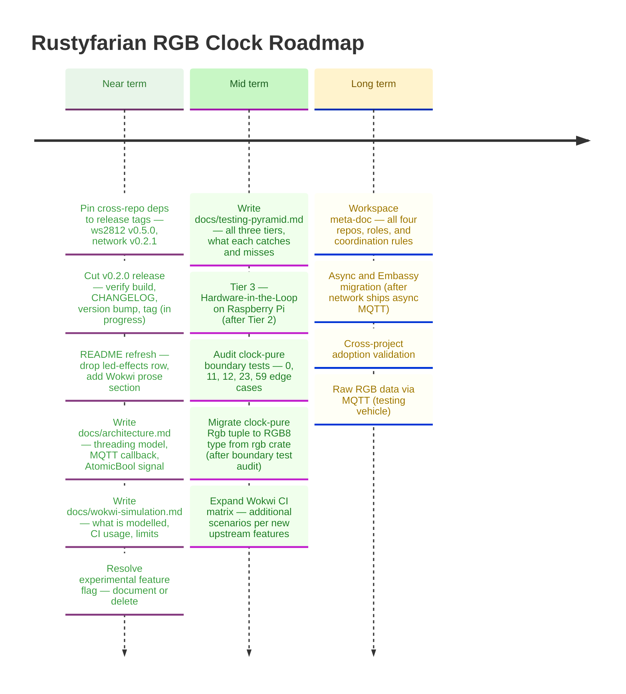

# Roadmap

*Last updated: May 2026*

A May 2026 deep-dive review confirmed the near-term tier is complete and repositioned the project: the rgb-clock is the **integration test fixture** for the rustyfarian workspace — its testing pyramid validates that ws2812, network, and the embedded toolchain work together at every release.
The immediate focus is cutting v0.2.0, which consolidates ~12 weeks of upstream-tracking work and establishes a stable, pinned integration baseline.
Items move to `Ready` when they have a feature document in `docs/features/`.

```mermaid
%%{init: {
  "theme": "base",
  "themeVariables": {
    "cScale0": "#e8f5e9",
    "cScaleLabel0": "#2e7d32",
    "cScale1": "#c8f7c5",
    "cScaleLabel1": "#1b5e20",
    "cScale2": "#fff3cd",
    "cScaleLabel2": "#7a5a00",
    "cScale3": "#e3f2fd",
    "cScaleLabel3": "#0d47a1"
  }
}}%%

timeline
    title Rustyfarian RGB Clock Roadmap

    Near term : Pin cross-repo deps to release tags — ws2812 v0.5.0, network v0.2.1
              : Cut v0.2.0 release — verify build, CHANGELOG, version bump, tag (in progress)
              : README refresh — drop led-effects row, add Wokwi prose section
              : Write docs/architecture.md — threading model, MQTT callback, AtomicBool signal
              : Write docs/wokwi-simulation.md — what is modelled, CI usage, limits
              : Resolve experimental feature flag — document or delete

    Mid term  : Write docs/testing-pyramid.md — all three tiers, what each catches and misses
              : Tier 3 — Hardware-in-the-Loop on Raspberry Pi (after Tier 2)
              : Audit clock-pure boundary tests — 0, 11, 12, 23, 59 edge cases
              : Migrate clock-pure Rgb tuple to RGB8 type from rgb crate (after boundary test audit)
              : Expand Wokwi CI matrix — additional scenarios per new upstream features

    Long term : Workspace meta-doc — all four repos, roles, and coordination rules
              : Async and Embassy migration (after network ships async MQTT)
              : Cross-project adoption validation
              : Raw RGB data via MQTT (testing vehicle)
```

See [testing-strategy.md](testing-strategy.md) for the full three-tier implementation plan.
