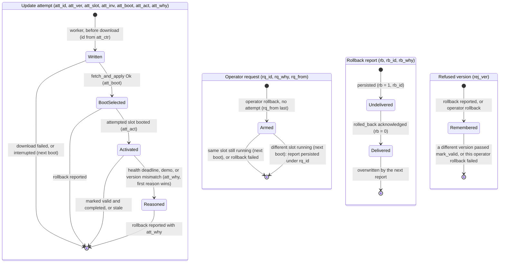

# Feature: OTA MVP Demo — MQTT-triggered A/B Update with Rollback

*Status: Draft*

*Delivered so far on branch `ota-mvp`: the A/B partition layout, the rollback-capable IDF-built bootloader, the flash and validation tooling, hardware sequence items 1 to 3, and — as of 2026-09-28 — the OTA application flow: `src/ota/` (worker, sidecar fetch, health policy, rollback record), `just ota-artifact`, `just ota-serve` and `just build-unhealthy`. Hardware items 4 to 8 passed on the ESP32-C3 on 2026-09-28, including the malformed-command check in item 8 after the fix for bug 001 (`docs/bugs/archive/001-rejected-ota-command-deadlocks-mqtt-2026-09-28.md`).*

## Goal

Deliver a working over-the-air firmware update demo on the ESP32-C6 in the next release, so the rustyfarian workspace has one repeatable, hardware-validated OTA path instead of a library with no caller.

## Context

The OTA library is finished upstream in `rustyfarian-network`: `juggler::ota` (version, verifier, metadata, state; ~36 host tests), and the ESP-IDF tier's `OtaSession::fetch_and_apply` → `EspOta` swap → `mark_valid`/`rollback`.
What has never existed anywhere is a consumer: no partition table with OTA slots, no rollback-enabled bootloader, no logic that decides an update is needed, and no flashable artefact.

Upstream ADR 011 §3 assigned the demo binary and `partitions.csv` to `rustyfarian-ferriswheel-demo`.
That assignment is amended here: the demo runs in this repository instead, because this repo is already the workspace's integration test fixture and is the only place where a real firmware consumes the Wi-Fi, MQTT, provisioning and LED stacks together.
The local ADR records the amendment.

Constraints that shape the design:

- ESP32-C6 DevKitC-1, 4 MiB flash, ESP-IDF `v5.3.3`, `std` firmware.
- Flashing builds the firmware first, then calls `espflash flash` with an explicit `--bootloader` (`scripts/flash.sh`), not `cargo espflash` or an ESP-IDF menuconfig build.
- Wi-Fi and MQTT credentials live in NVS via SoftAP provisioning, so the OTA image must preserve the existing NVS region.
- The clock must keep displaying time while an update downloads.
- `rustyfarian-esp-idf-network` is consumed from crates.io at `0.5.0` with the `ota` feature enabled.

### Prerequisite: the September 2026 dependency wave

OTA work required a coordinated dependency bump before it could start, because the `ota` feature is only reachable through a `rustyfarian-esp-idf-network` revision that has moved to the September stack.
That wave has landed: `rustyfarian-esp-idf-network` has since moved from a git pin to crates.io `0.5.0` with the `ota` feature enabled, and `decide_update` ships as part of it, so no interim `Version` comparison is needed here.

| Component                                   |                        From | To                                |
|:--------------------------------------------|----------------------------:|:----------------------------------|
| `rustyfarian-esp-idf-ws2812`, `ferriswheel` |                       0.6.0 | 0.7.0                             |
| `pennant` (transitive)                      |                         0.6 | 0.7                               |
| `esp-idf-svc`                               |                        0.52 | 0.53                              |
| `esp-idf-hal`                               |                        0.46 | 0.47                              |
| `rustyfarian-esp-idf-network`               |               git `8fc9f5f` | crates.io `0.5.0` (`ota` feature) |
| Rust toolchain                              | `nightly-2025-12-01` (1.93) | `nightly-2026-01-26` (1.95)       |

The wave is not separable into smaller steps.
`rustyfarian-esp-idf-ws2812 0.6` implements `pennant 0.6`'s `StatusLed`, which post-wave network no longer accepts; `0.7` implements `pennant 0.7` but declares `rust_version = "1.95"`, which the current `nightly-2025-12-01` (rustc 1.93.0-nightly) cannot satisfy.
Every pin moves together or none does.

Network's own changelog records the wave as compile-verified only; validating it on hardware is this repository's job.
**Done on 2026-09-27**: baseline `b58d2b4` ran on an ESP32-C6-DevKitC-1 with the crates.io `0.7.0` ws2812 wave, `esp-idf-svc 0.53`, `rustyfarian-esp-idf-network 0.5.0` and `nightly-2026-01-26`, covering SoftAP provisioning, STA join, DHCP, MQTT subscribe and `tick` rendering.
One regression surfaced: the main task overflows its 8000-byte stack by 40 bytes inside network's `wait_committed` right after the portal commits, because it clones `Option<ProvisioningConfig>` on the caller's stack.
The reboot that follows lands on the provisioned path, so the clock still comes up; see `docs/project-lore.md` "MQTT & Networking" and `docs/outbox/rustyfarian-network-wait-committed-stack-clone.md`.
Fixed locally the same day: `CONFIG_ESP_MAIN_TASK_STACK_SIZE` is now 16384 in `sdkconfig.defaults`, and a clean rebuild plus a full erase, re-flash and re-provisioning showed the commit completing with the firmware's own "Provisioning committed — restarting into normal boot" line and no fault.
The upstream clone is still worth removing; the outbox request stays open.

The wave also carries two edits unrelated to version numbers.
`PortalConfig` gained two fields upstream, so the struct literal in `run_provisioning` must add `ssid_override: None` and `defaults: PortalDefaults::default()` to keep today's behaviour — a source-breaking change for any code constructing it by name.
And the nightly is pinned in two places: `rust-toolchain.toml` and three hardcoded lines in `.github/workflows/rust.yml`.
The workflow is changed to read the channel out of `rust-toolchain.toml` so there is exactly one pin site and CI cannot silently compile on a different compiler than a developer's machine.

## Decisions

- **The wave lands as its own commit, hardware-validated before any OTA code.**
  A failure then implicates the dependency bump or the OTA feature, never both.
  Both ship in the same release.

- **OTA slots are 1.75 MiB (`0x1C0000`) each, deviating from ADR 011's 1 MiB.**
  ADR 011 sized slots for a minimal ESP32-C3 MQTT example.
  This image carries Wi-Fi, MQTT, a captive-portal HTTP server, WS2812, `ferriswheel` and OTA, which measured 1,452,669 bytes (1.39 MiB) once the wave built.
  ADR 011's 1 MiB slots would overflow it, and 1.5 MiB would leave only 117 KiB of headroom for the OTA worker, the sidecar HTTP client and SHA-256 still to be added, so 1.75 MiB was chosen against that measured figure rather than an estimate.

- **`phy_init` is kept, also deviating from ADR 011.**
  The existing table has it; removing it is unrelated risk inside a release that already moves the entire dependency stack.

- **The NVS region keeps its exact offset and size (`0x9000`, `0x6000`).**
  The layout change alone therefore cannot invalidate provisioned credentials, which keeps later partial reflashes safe.
  The one-time first flash still erases the whole chip for the reason given below, so credentials are re-entered once regardless.

- **`scripts/flash.sh` must pass `--bootloader` and `--ignore-app-descriptor`, or rollback cannot work at all.**
  espflash 4.x bundles an ESP-IDF v5.5.1 bootloader and writes it whenever `--bootloader` is absent, which is the case today.
  That bootloader is not built from this project's `sdkconfig.defaults`, so `CONFIG_BOOTLOADER_APP_ROLLBACK_ENABLE=y` never reaches the device while `mark_valid()` still returns success — a silent failure with healthy-looking logs.
  It also uses a 32 KB MMU page size against the v5.3.3 app's 64 KB.
  The fix is already implemented in `rustyfarian-network`'s own `flash.sh` and is documented in its lore; this repository never adopted it.
  Point `--bootloader` at the `esp-idf-sys`-built `bootloader.bin` under `target/<target>/release/build/esp-idf-sys-*/out/build/bootloader/`.
  `scripts/preflight.sh` builds, validates `partitions.csv`, resolves exactly one bootloader (`just bootloader-path <target>` prints it), refuses unless rollback is compiled into that binary, and runs `just image-check`, whose image stays at `tmp/<target>-app.bin`.
  `just flash-baseline` builds and validates before the full erase, pins one serial port across erase and flash, and requires typing `ERASE`, so a compile error or an ambiguous port cannot leave a wiped or wrong device.
  `just partition-check` needs bash 4 or newer; macOS ships 3.2, so install it with `brew install bash` (`just doctor` shows which one is on `PATH`).

- **Update-decision logic lives upstream in `juggler::ota`, not here.**
  It is the only way the bare-metal tier inherits it later.
  The dependency wave and the crates.io move are both done, and `decide_update(running, offered) -> UpdateDecision` ships in network `0.5.0`, so this firmware calls the `Apply`/`Skip`/`Reject` policy directly — no interim `Version` comparison is written that would later be thrown away.

- **The MQTT command carries an optional `sig` field from day one, accepted and ignored.**
  Signed manifests then become a non-breaking addition rather than a schema change.

- **The sidecar fetch was implemented locally at first** (superseded 2026-10-06: the upstream runtime's manifest fetch replaces it).
  Upstream's `FirmwareDownloader` is private and its `ota` module exposes no small-body GET.
  `EspHttpConnection` has inherent `status()`, `header()` and `initiate_request()` plus `impl Read`, reachable through `esp_idf_svc::io`, so this needs roughly fifty lines and no new dependency.
  Blocking the release on an upstream API for this would be disproportionate.

- **The MQTT callback parses and enqueues only; the download runs on a dedicated thread.**
  A multi-minute blocking download inside the event-loop callback would deadlock the client — upstream's `publish_acked` has a `WrongThread` error variant for exactly this mistake.

- **The bootloader rollback demo uses a valid-but-unhealthy image, not a truncated one.**
  See below; this corrects the assumption inherited from the upstream analysis.

<details>
<summary><strong>Partition layout</strong></summary>

```
# Name,   Type, SubType, Offset,   Size,     Flags
nvs,      data, nvs,     0x9000,   0x6000,
otadata,  data, ota,     0xf000,   0x2000,
phy_init, data, phy,     0x11000,  0x1000,
ota_0,    app,  ota_0,   0x20000,  0x1c0000,
ota_1,    app,  ota_1,   0x1e0000, 0x1c0000,
```

Slot size is `0x1C0000` (1.75 MiB), chosen against a measured figure rather than an estimate.
The release image on 2026-09-26, before any OTA code, is **1,452,669 bytes (1.39 MiB)** — the sum of allocated `PROGBITS` sections.
That is an **estimate** of the downloadable image, not the artefact itself: the flashed `.bin` is assembled from the ELF and carries its own header and padding.
Treat the headroom figures below as pre-OTA-code and provisional.
Remeasured on 2026-09-28 with the OTA application layer linked in, including the update-attempt reconciliation: the C6 release `.bin` from `just image-check` is **1,603,536 bytes** (87 % of a slot, 226 KiB headroom), so the 1.75 MiB slots hold.
When `just ota-artifact` lands it must validate the generated `.bin` against both slot sizes and hash those exact bytes, and the image must be remeasured then — `scripts/check-partitions.sh`'s `MIN_SLOT` constant is a historical floor that cannot catch future growth on its own.
ADR 011's 1 MiB slots would overflow it by 395 KiB, and 1.5 MiB would leave only 117 KiB of headroom for the OTA worker, the sidecar HTTP client and SHA-256 still to be added.
1.75 MiB leaves roughly 330 KiB of headroom after that code lands and still keeps 384 KiB of flash free at the tail for the signed-manifest partition `ota-hardened` will want.

**App partition offsets must be 64 KiB aligned**, not 4 KiB — `gen_esp32part.py` rejects anything else, and the IDF-built v5.3.3 bootloader uses 64 KiB MMU pages.
This is why `ota_0` starts at `0x20000` rather than immediately after `phy_init`, and the intervening 56 KiB is alignment padding.
Do not "reclaim" it by moving the app partitions down to a 4 KiB boundary; the table will not build.

`sdkconfig.defaults` gains `CONFIG_BOOTLOADER_APP_ROLLBACK_ENABLE=y`.
`CONFIG_PARTITION_TABLE_CUSTOM` is irrelevant because espflash supplies the table.
Two separate steps are then both required before rollback is armed: `just clean-idf`, so a bootloader is rebuilt with the new setting, and the `--bootloader` flag above, so that rebuilt bootloader actually reaches the device.
Either one alone leaves rollback silently disabled.

First flash with the new table requires a full chip erase, because the region that becomes `otadata` previously held `phy_init` and application bytes, so its contents would be garbage that the bootloader may interpret as slot state.
The erase wipes NVS, so the device must be re-provisioned once.
This is a one-time cost paid at the layout change, not on subsequent OTA updates.

</details>

<details>
<summary><strong>Rollback mechanics</strong></summary>

`OtaSession::fetch_and_apply` compares the streamed SHA-256 against the expected digest *before* calling `ota_writer.complete()`, which is what sets the boot partition.
A truncated or corrupted image therefore returns `ChecksumMismatch`, aborts the write, and leaves the boot slot unchanged.
The device never boots the bad image and the bootloader never rolls anything back.

Bootloader rollback fires only when a well-formed, correctly-hashed image *is* activated and then fails to call `esp_ota_mark_app_valid_cancel_rollback()` before the next reboot: the slot moves `PENDING_VERIFY` → `ABORTED` and the bootloader boots the other slot.
`INVALID` is what an explicit `esp_ota_mark_app_invalid_rollback_and_reboot()` sets, so the two paths are distinguishable when inspecting slot state during the demo.
Demonstrating rollback therefore requires an image that passes verification and then deliberately fails its health check.

Withholding `mark_valid` does **not** by itself reboot the device, so the unhealthy image needs an explicit bounded failure policy: it must reset itself (a deliberate `restart()` after a fixed dwell, or a watchdog it stops feeding) or the slot sits in `PENDING_VERIFY` indefinitely and nothing rolls back.

Three distinct scenarios result, all worth showing:

| Scenario | Mechanism | Proves |
|:---------|:----------|:-------|
| Truncated image | `ChecksumMismatch`, abort, boot slot untouched | Verify-before-swap |
| Unhealthy v2 | Valid image, feature-gated to skip `mark_valid` and reboot after 15 s | Bootloader A/B rollback |
| Operator rollback | `OtaSession::rollback()` driven by an MQTT command | Manual recovery |

The unhealthy image is produced by a Cargo feature that is never enabled in a release build.

</details>

<details>
<summary><strong>Firmware structure and MQTT contract</strong></summary>

```
src/ota/mod.rs      topics, firmware version, OtaConfig (upstream default timings, 6 KiB
                    reporter stack, unhealthy-demo deadline action)
src/ota/policy.rs   the clock's health predicate: fresh tick, MQTT connected, IPv4 lease
```

Since 2026-10-06 everything else is the upstream OTA consumer runtime (`rustyfarian_esp_idf_network::ota::runtime`, sub-projects A–D): command intake, worker and reporter threads, manifest fetch, NVS records in namespace `ota`, boot reconciliation and the health policy around the predicate above.

Topics stay flat, matching the existing `"tick"` convention: `ota/command` inbound, `ota/status` outbound.

The command payload is deliberately minimal — `{ "manifest_url": String, "sig": Option<String> }`.
A second shape, `{ "action": "rollback", "from": "<running version>" }`, drives the operator rollback (hardware scenario 5); it is executed only when `from` equals the version the firmware reports (`FIRMWARE_VERSION`, the package version unless overridden at build time), so a retained or redelivered rollback cannot ping-pong the device between slots.
Both are parsed by the upstream wire contract (`OtaCommand::parse`, rustyfarian-network sub-project B) into one flat `deny_unknown_fields` struct rather than an untagged enum: serde's untagged dispatch buffers and recurses per nesting level, and this parse runs on the MQTT event-loop thread's stack.
Everything authoritative lives in the fetched manifest (`version`, `sha256`, and the firmware `url`), so the reserved `sig` later covers the firmware identity *and* its location in one signature rather than leaving the URL outside the signed envelope.
The MVP parses `sig` and ignores it; the call site in `OtaSubmitter::submit` carries a comment, not just a doc comment, so a future implementer cannot miss that the trust boundary moves when it is honoured.

Both the command and the manifest are bounded before parsing: the MQTT payload is rejected above a fixed byte cap, the sidecar body is read into a fixed buffer and rejected if it fills before EOF, and the sidecar fetch carries its own connect and read timeout rather than inheriting the firmware download's.
An unbounded payload on a public topic is a trivial memory-exhaustion path on a device with a few hundred KiB of heap.

The manifest also carries a **target** field naming the chip it was built for, and the firmware refuses an image whose target is not its own.
This repository builds the same source for both ESP32-C6 and ESP32-C3, and the two images are not interchangeable — without this field a single broadcast on `ota/command` could push a C6 image onto a C3.
The serial flash path guards against that with an `espflash board-info` chip check, because `--ignore-app-descriptor` disables espflash's own; the OTA path has no equivalent unless the manifest carries the target.

Status messages are a tagged enum on `ota/status`: `downloading`, `swap_pending`, `applied { version }`, `failed { reason }`, `rolled_back { reason, attempt_id, epoch }`.
`rolled_back.reason` names how the rollback came about: `operator`, `health_deadline`, `unhealthy` (the demo image; records stored as `unhealthy_demo` by older builds are sent as `unhealthy`), `version_mismatch` (the booted image did not report the version its manifest promised), `bootloader` (reconciled at boot after a crash, a power loss, or the bootloader's own `ABORTED` path), or `unknown` (no stored label, or one this build does not recognise).
`rolled_back.attempt_id` is the id of the update attempt (or of the operator rollback) the report belongs to, and `rolled_back.epoch` a random install epoch created once with the id counter; delivery is at least once, so a backend deduplicates on device, `epoch` and `attempt_id`, which stays unique across a full flash erase.
`verifying` and `writing` are not emitted: `OtaSession::fetch_and_apply` streams download, hash and flash write in one call, so those transitions are not observable by the firmware.
`reason` in `failed { reason }` is a fixed code, never server-supplied text:

| Reason                                                      | Raised when                                                                                                                                                                |
|:------------------------------------------------------------|:---------------------------------------------------------------------------------------------------------------------------------------------------------------------------|
| `command_invalid`                                           | The `ota/command` payload is too large, not JSON, an unsupported field combination, a manifest URL that is not plain `http://`, or a rollback `from` that is not a version |
| `busy`                                                      | An update is already queued or running                                                                                                                                     |
| `worker_unavailable`                                        | The OTA worker thread is not running                                                                                                                                       |
| `pending_verify`                                            | The running image has not marked itself valid yet; refuses updates (`esp_ota_begin` would) and operator rollbacks (the health policy owns that window)                     |
| `manifest_fetch`                                            | The manifest URL could not be fetched                                                                                                                                      |
| `manifest_invalid`                                          | The manifest is too large, malformed, carries an unparsable version or hash, or a firmware `url` that is not plain `http://`                                               |
| `target_mismatch`                                           | The manifest was built for the other chip                                                                                                                                  |
| `up_to_date`                                                | The offered version equals the running one (`Skip`)                                                                                                                        |
| `downgrade`                                                 | The offered version is older than the running one (`Reject`)                                                                                                               |
| `previously_rolled_back`                                    | The offered version is the one the last rollback left                                                                                                                      |
| `report_pending`                                            | Deferred: a rollback report is not acknowledged yet; the offer is retained and retried automatically                                                                       |
| `attempt_unresolved`                                        | Deferred: an earlier update attempt is still open; the offer is retained and retried automatically                                                                         |
| `version_invalid`                                           | The running version does not parse, or the library reports `VersionInvalid`                                                                                                |
| `version_mismatch`                                          | A rollback command's `from` is a valid version but not the running one                                                                                                     |
| `rollback_unavailable`                                      | The operator rollback found no valid previous slot                                                                                                                         |
| `attempt_not_persisted`                                     | The update attempt could not be written to NVS; nothing was downloaded                                                                                                     |
| `partition_not_found`                                       | No update slot, or the running slot could not be read                                                                                                                      |
| `server_unreachable`, `download_failed`, `download_timeout` | The firmware download failed (`OtaError`)                                                                                                                                  |
| `checksum_mismatch`                                         | The image's SHA-256 does not match the manifest; the boot slot is unchanged                                                                                                |
| `insufficient_space`, `flash_write_failed`                  | The image does not fit, or writing it failed (`OtaError`)                                                                                                                  |

A deferred offer (`report_pending`, `attempt_unresolved`) reports `failed` once and is then retried by the device, so the same offer may later produce `downloading`, `applied`, or another `failed`.

Progress states publish best-effort and may be dropped.
**Only `rolled_back` uses `publish_acked`.**
Note precisely what that buys: `publish_acked` waits for the broker's PUBACK, which is *not* persistence.
Surviving a reboot is the firmware's job — the rollback evidence must be written to NVS before the publish is attempted, retried at startup while the flag is set, and cleared only once `publish_acked` returns `Ok`.
Without that, an unreachable broker at exactly the wrong moment loses the one record that a rollback happened.
The image that wants to roll back cannot know whether it will succeed, so it only records why before rebooting: when it is the attempted image, the reason goes next to the attempt (`att_why`) and is read only if boot reconciliation later reports the rollback; otherwise (operator rollback after `mark_valid`, or a serial-flashed image) it writes a rollback request (`rq_*`) with the slot it is leaving, which the next boot reports only if a different slot is running.
A rollback that never happened is therefore never announced, even while `OtaSession::rollback()` is being retried with the broker connected.
Delivery is at-least-once: a PUBACK that arrives after the 5 s wait leaves the record set, and the next attempt publishes again while the client may still be resending the first.

A second record covers rollbacks the firmware never gets to write about.
Before an image is activated the worker persists the **update attempt** — the promised version and the target slot label — and clears it again if the download fails.
The attempt is flagged *activated* once `fetch_and_apply` has switched the boot slot, and again first thing in `main` whenever the running slot is the attempted one, so a power loss between the slot switch and that write, or a crash later in the first boot, cannot hide the activation.
An attempt without the flag whose target slot is not newly `Invalid` was interrupted mid-download and is discarded, since nothing was ever activated; the attempt also records whether the target slot was already invalid, so a stale `ABORTED` from an earlier demo is not read as a fresh rollback.
Reports are persisted before the evidence they came from is removed, and reconciliation is idempotent, so a power loss in between repeats the work on the next boot instead of losing the event.
Update admission stays closed until the health policy has finished with the running slot (marked valid and the attempt cleared, nothing to verify, or given up), so the policy's cleanup can never wipe a newer attempt's record.
If the running slot stays unreadable until the failure deadline (after at least five reads), the policy neither rolls back nor opens admission, so updates are answered with `pending_verify` until the next reset — unless boot reconciliation already opened admission for a slot it read as not pending verification.
Two narrow limits are accepted and documented rather than closed: two rollbacks inside one unacknowledged report window merge into a single report carrying the first reason, and an image that lost power before its activation flag was written *and* crashed before `main` ran is indistinguishable from an interrupted download when its slot was already invalid (esp-idf-svc folds `ABORTED` and `INVALID` into one state), so that one case goes unreported.
On every boot an activated attempt is reconciled against reality before the health policy starts: the attempted slot running the promised version is left to the health check (the attempt is cleared on `mark_valid`); the attempted slot running a *different* version while still `PENDING_VERIFY` means the manifest lied, so the image writes `rolled_back { version_mismatch }` and rolls back at once, or refuses `mark_valid` if it cannot (a serial-flashed slot is never `PENDING_VERIFY`, so a stale attempt left behind by `just flash` is only discarded); and the previous slot running again means a rollback happened — if no record is pending yet it is written as `bootloader`, so a crash or power loss after activation still produces a report.
If boot reconciliation cannot read the running slot at all, it leaves the records in place and sets `refuse_mark_valid`, so an image that is still `PENDING_VERIFY` is never marked valid and rolls back at the deadline or on the next reset.
This also closes the retained-command loop: an image whose manifest advertised a higher version than the binary reports would otherwise be reinstalled on every redelivery.
The version left by any rollback (operator command, health deadline, version mismatch, or the bootloader's own verdict) is also kept in NVS, and a redelivered offer of exactly that version is refused as `previously_rolled_back`; the memory is forgotten only when a different version is actually applied (past the target, version and admission checks), not on any offer.
An NVS read error on the rollback or attempt records fails safe like an unreadable slot: the records stay in place and the image is not marked valid.

NVS records in namespace `ota` carry this state; the decisions come from upstream `juggler::ota` (`reconcile`, `decide_offer`, `Admission`), every write is in `src/ota/mod.rs` or `src/ota/policy.rs`:



`att_ctr` and `att_epoch` are never removed, so attempt ids keep increasing and the epoch identifies the install.
A rollback reason is only read when a rollback is actually reported, so a reason written by an image that then never rolls back is never announced.
Admission refuses new offers while the running image is unverified (`pending_verify`); an offer that would otherwise be applied while an attempt record is open or a report is undelivered is deferred (`attempt_unresolved`, `report_pending`): the worker keeps its manifest URL in RAM and applies it once admission reopens, without a second status.


The version an image claims is `RUNNING_VERSION`, set once by `build.rs`: `FIRMWARE_VERSION_OVERRIDE` when given (the demo's `OTA_VERSION`), else the `Cargo.toml` package version.
`just ota-artifact` writes the same value into the manifest, boot reconciliation refuses an image whose `RUNNING_VERSION` differs from its manifest's, and the refused-version record only ever stores versions that were offered or running.

A single-slot channel is **not** sufficient to reject concurrent commands: once the worker receives the first one the slot is free again, so a second command queues behind an in-flight update.
The worker therefore owns an explicit busy flag covering both queued and executing work, and the callback uses a non-blocking `try_send` — rejecting with a logged `failed` status when busy, and never blocking the MQTT event loop.
The `MqttHandle` is retained in `run_clock` and cloned into the worker and the reporter, since `publish_acked` returns `WrongThread` if called from the event-loop thread.
Rejections (`command_invalid`, `busy`, `worker_unavailable`) are **never** published from the callback: the ESP-IDF MQTT task holds its API lock while it waits for `on_message` to release the event, so any enqueue from the callback deadlocks the client for good (bug 001).
The callback `try_send`s the reason into a bounded queue (depth 4), and a small `ota-reporter` thread (6 KiB stack) publishes `failed { reason }`; a full queue drops and counts the rejection, and the reporter logs the count.
The reporter is separate from the worker because `busy` fires exactly while the worker is blocked in a download.

The worker thread starts at a 16 KiB stack — the MQTT event loop uses 12 KiB for a far lighter callback, and this path adds the HTTP client, the flash write and SHA-256 frames.
That number is a starting estimate to be confirmed on hardware, not a derived one: the worker logs `uxTaskGetStackHighWaterMark` just before a successful update restarts, before an operator rollback, and after every failed job.
On ESP-IDF's RISC-V port `StackType_t` is `u8`, so that figure is already in bytes, not the words upstream FreeRTOS documents.
The reporter's 6 KiB stack is the same kind of starting estimate: the reporter logs its high-water mark after every rejection it publishes, so the figure is confirmed on hardware too.

The `mark_valid` policy runs on the main thread after setup completes, in place of the bare `std::thread::park()`, not inline with the IP wait at `run_clock`.
That wait deliberately continues past a timeout so a slow DHCP lease cannot leave the ring dark, and bolting a 30 s dwell onto it would undo that.
A dedicated thread was considered and dropped: after setup the main thread only parks, its stack is already 16 KiB, and it owns the `WiFiManager` the policy polls (dropping that handle would disconnect Wi-Fi).
The dwell is measured from an `Instant` captured at `run_clock` entry, since ADR 011 §4 specifies 30 s **since boot**, not since association.
Calling `mark_valid` on a slot that is not pending verification is harmless.

**Health means more than a DHCP lease here.** ADR 011 §4's "IPv4 plus 30 s" is the workspace-wide floor, and on its own it would accept a build whose MQTT subscription or clock rendering is broken — precisely the regressions an OTA push is most likely to introduce.
This firmware's criterion is therefore all of:

- the clock driver initialised and the display wrote at least one frame,
- the MQTT client connected **and** a `tick` message received and applied within the last 10 s, proving the subscription path end to end and that the clock is still rendering now rather than having rendered once and stalled,
- an IPv4 lease acquired, and
- 30 s elapsed since boot.

**Failure is on a deadline, not left to a watchdog.**
Never calling `mark_valid` is not a policy: the slot would sit in `PENDING_VERIFY` forever and the clock would keep running a firmware whose MQTT path is broken, since nothing reboots it.
The health thread therefore carries an explicit deadline of **120 s since boot** — four times the 30 s success dwell, which absorbs a slow DHCP lease plus one Wi-Fi reconnect and one MQTT reconnect.

At the deadline, if the running slot is in `PENDING_VERIFY` and the criteria are still unmet, the firmware calls `OtaSession::rollback()`, which marks the slot `INVALID` and reboots into the previous image.
Recovery never depends on reporting: the NVS record is best-effort, and `rollback()` is retried three times five seconds apart in case the `EspOta` singleton is transiently held.
If every attempt fails there is no rollback target, and the clock keeps running the pending image rather than resetting into a bootloader that would then have no bootable app — that reset is left to the operator.
A failed `mark_valid` likewise keeps the policy polling until the deadline instead of parking.
That is deliberate and immediate rather than dependent on a watchdog firing, and it is distinguishable in the logs from the automatic `ABORTED` path.

Two guards on that behaviour:

- It applies **only** to a slot in `PENDING_VERIFY`. A normally-booted, already-valid image must never reboot itself because MQTT happens to be down — that would turn a broker outage into a reboot loop on a working clock.
- The `rolled_back` record is written to NVS before the reboot, so the evidence survives to be published on the next boot (see the persistence note above).

The unhealthy-image demo build (`--features unhealthy`, `just build-unhealthy`) forces the health check to fail, shortens the deadline to 15 s, writes the `rolled_back` record, and then calls `restart()` rather than `OtaSession::rollback()`.
Only a plain reset lets the *bootloader* move the slot from `PENDING_VERIFY` to `ABORTED`, which is what scenario 7 proves; the release build's 120 s path sets `INVALID` itself and is scenario 8.

</details>

<details>
<summary><strong>Tooling and documentation deliverables</strong></summary>

New `just` recipes, since every build and flash operation in this project goes through `just` and direct `espflash` invocation is blocked by a repository hook:

- `ota-artifact` — build, size-check and stage the binary, compute its SHA-256, and write the sidecar JSON; `OTA_VARIANT`, `OTA_VERSION`, `OTA_TRUNCATE` and `OTA_TICK_TOPIC` drive the demo variants (`just` arguments are positional, so knobs are environment variables)
- `ota-serve` — serve the staged artefacts over plain HTTP from `tmp/` for the demo
- `flash-baseline` — full erase plus first flash with the OTA table, for the one-time layout change
- `board-info` — print the attached chip type; `scripts/flash-image.sh` runs the same query itself and refuses a chip that differs from the requested target, since `--ignore-app-descriptor` disables espflash's own chip-model check
- `image-check` — generate the exact app image with `espflash save-image` and fail if it does not fit both slots; `preflight.sh` runs it (after `check-partitions.sh`) before every flash and CI runs it for both chips on every build, so the `MIN_SLOT` constant in `check-partitions.sh` is only a historical floor. The image is kept at `tmp/<target>-app.bin`, overwritten per run, as the artefact `ota-artifact` will later hash
- `flash-image-tests` — hardware-free regression suite for the flash script's chip-mismatch and dry-run guards, driven by a fake `espflash`; `DRY_RUN=1` on `flash` or `flash-baseline` prints the device-touching commands without running them
- `build-unhealthy` — build the feature-gated image used by the rollback scenario

Documentation:

- A local ADR recording the ADR 011 §3 amendment (demo hosted here) together with the 1.75 MiB slot and `phy_init` deviations
- `docs/ota-security-model.md` — threat model, why SHA-256 over plain HTTP is the MVP's limit, rollback policy, and the reserved `sig` field
- ~~An outbox request to `rustyfarian-network`~~ — **delivered in network `0.5.0`**, so no request is outstanding.
  The decision API is one `core`-only function in a new `juggler::ota::decision` module: `decide_update(running: Version, offered: Version) -> UpdateDecision`, where `UpdateDecision` is `Apply` / `Skip` / `Reject` for strictly-newer, equal and older respectively.
  No new error variant is needed, because both inputs are already-parsed `Version`s and `Version::parse` already reports malformed input.
  `OtaState` deliberately gains no `Display` or serde implementation upstream; the status-string mapping stays a small match in this firmware so the library stays policy-free
- A near-term roadmap entry, a changelog entry, and the version bump to 0.3.0

</details>

## Open Questions

- [x] What is the measured release image size, and does it confirm 1.5 MiB slots? Blocked until the dependency wave builds.
      Answer: 1,452,669 bytes (1.39 MiB) as of 2026-09-26 — 1.5 MiB slots would leave only 117 KiB of headroom, so slots were sized to 1.75 MiB (`0x1C0000`) instead.
- [x] Does the retained MQTT handle support sharing with the worker thread as-is, or does it need an `Arc`?
      Answer: as-is. `MqttHandle` in network `0.5.0` is `Clone` over `Arc` fields and every publish method takes `&self`; the worker and the health policy each hold a clone.
- [x] Should the LED ring show OTA progress, or keep displaying time unchanged throughout? A product question, not an architectural one.
      Answer: keep the time. The worker never takes the clock mutex, so ticks keep rendering through a download; progress is on `ota/status` and the serial log.
- [x] `decide_update` compares the manifest version with the running one; can `OTA_VERSION=X just ota-artifact` label any build?
      Answer: no longer. `OTA_VERSION` is passed to the build as `FIRMWARE_VERSION_OVERRIDE`, which `build.rs` validates and bakes in as the version the firmware reports, so image and manifest agree by construction; a manifest that promises a version the booted image does not report is refused at reconciliation and rolled back.

Resolved during design: the status state machine does **not** move into `clock-pure`.
That crate is scoped to time-to-LED-index mapping and colour utilities, `just test` runs only `-p clock-pure`, and nothing in `src/` is host-tested today — even `LocalTime`'s JSON parsing has no coverage.
Introducing a host-test seam for the firmware binary is a build-pipeline change that does not belong in this feature.

## Validation

- [ ] Host tests (`just test`) — thin here by design: decision-logic coverage lives upstream in `juggler`, and this tier only gains host tests if the status state machine moves into `clock-pure`.
      Follow-up (2026-09-28 review): command validation, the busy-flag protocol, the health decision, and attempt reconciliation are pure enough to host-test, but the firmware binary cannot `cargo test` on the host, so they need a small host-testable crate of their own; that is a build-pipeline change and is tracked separately from this feature
- [ ] Failure injection on hardware (after items 4–8), each expecting exactly one report or none: pull power between `swap_pending` and the restart (expect the new image to boot and verify normally); pull power mid-download (expect no `rolled_back` and the next update to proceed); hold the alternate slot invalid and force the deadline with ticks stopped (expect no `rolled_back` while the image keeps running, then `rolled_back { health_deadline }` after a power cycle); send an update in the first 30 s after an OTA boot (expect `failed { pending_verify }`)
- [ ] Wokwi simulation (`just act-ci`) — Wokwi does not model OTA partition swaps or bootloader rollback, so it verifies nothing here beyond continued boot
- [x] Hardware-in-the-loop — physical device required; this is where the feature is actually proven
- [ ] Docs / config only

Hardware sequence — items 1 to 3 on the ESP32-C6, items 4 to 8 on the ESP32-C3:

The C3 (`/dev/cu.usbserial-210`, revision v0.4) was onboarded from scratch on 2026-09-28 by repeating items 2 and 3: `just flash-baseline idf_c3_rgb_clock` wrote 0.3.0 straight into `ota_0` (1,549,392 bytes, 84 % of a slot), SoftAP provisioning committed without a stack fault, and a power cycle came back on `ota_0` with the slot reported `Valid`.
Serial-flashing 0.3.0 directly replaces the separate `just flash` prerequisite of item 4.
Logs are in `tmp/c3-onboard-*.txt` and `tmp/c3-ota-status-log.txt`, not committed.

1. [x] Flash the dependency wave alone; confirm the clock keeps time and provisioning still works. This is also the workspace's first hardware validation of the September stack.
   Done 2026-09-27 together with item 2, since the wave and the OTA layout ship in one baseline commit: the clock tracks `tick`, and provisioning persists and reboots into a working clock. The `wait_committed` stack overflow found on the first run was fixed by the 16384-byte main stack and re-verified the same day with a second erase, flash and provisioning cycle.
2. [x] Full erase, flash the new partition table, re-provision once, confirm boot from `ota_0`.
   Done 2026-09-27 via `just flash-baseline` on `/dev/cu.usbmodem2101` after `just board-info` confirmed an `esp32c6`; the boot log shows the IDF-built v5.3.3 bootloader, the five-row table with no `factory` entry, and `Loaded app from partition at offset 0x20000`. Image size 1,453,152 bytes, 79.19% of the slot.
3. [x] Power-cycle twice; confirm both boots come from `ota_0` with no rollback and no boot loop. Expect **no** `mark_valid` at this stage: the baseline carries no OTA application code, and a serial-flashed slot is not in `PENDING_VERIFY` anyway because the erase left `otadata` blank. Its absence is not evidence that rollback is broken.
   Done 2026-09-27: two USB power cycles, each followed by a `just monitor` connect reset to capture the bootloader log, since the USB-JTAG console cannot record a cold boot. Every boot loaded `ota_0` at `0x20000`, reached MQTT and cancelled the rainbow on the first `tick`; no rollback, `PENDING_VERIFY` or `ota_1` lines appeared. Logs are in `tmp/boot-log-*.txt`, not committed.
4. [x] Publish a good update; confirm download, verification, swap, reboot into `ota_1`, and `mark_valid`.
   Done 2026-09-28 on the C3 with `OTA_VERSION=0.3.1`: 1,549,616 bytes downloaded in about 11.5 s, SHA-256 verified, reboot into `ota_1` at `0x1e0000`, and `Image 0.3.1 healthy after 30 s; slot marked valid` at 31.6 s.
   `ota/status` carried `downloading`, `swap_pending`, `applied { 0.3.1 }`.
   Worker stack high-water mark across all five jobs of items 4 to 8: 10,228 to 13,288 bytes never used of 16,384, so peak use is about 6 KiB and `WORKER_STACK_BYTES` can shrink (not yet changed).
   Prerequisite: the 0.2.0 baseline on the device has no OTA consumer, so serial-flash the 0.3.0 build once (`just flash`; the slot is not `PENDING_VERIFY` after a serial flash, so the policy exits at once) and push the first update as `OTA_VERSION=0.3.1 just ota-artifact` — an offer equal to the running version is refused as `up_to_date`, and the override is baked into the image so it really reports 0.3.1.
   Read the `OTA stack high-water mark` line logged just before the restart and right-size `WORKER_STACK_BYTES` from it (bytes, see the lore entry).
5. [x] Send the operator rollback command `{"action":"rollback","from":"0.3.1"}`; confirm `OtaSession::rollback()` reboots into `ota_0` and that `rolled_back { operator }` is published from that boot.
   Runs **before** the truncated image on purpose: a rejected download has already overwritten the inactive slot by the time the hash fails (the library streams into flash and verifies at the end), so after item 6 there is no intact previous image to roll back to.
   Open risk: `ota_0` was serial-flashed and its `otadata` state is undefined rather than `VALID`; if ESP-IDF refuses to revert to it, push one more good update first so both slots have been through `mark_valid`.
   Done 2026-09-28 on the C3: `Rollback to previously worked partition. Restart.`, boot from `0x20000`, `Rollback (operator) from ota_1 confirmed`, and `rolled_back { operator }` acknowledged by the broker about 1 s after boot.
   The open risk did not materialise: ESP-IDF reports the serial-flashed `ota_0` as `Valid` after the erase and reverted to it without an extra update.
6. [x] Publish a truncated image (`OTA_VERSION=0.3.2 OTA_TRUNCATE=65536 just ota-artifact`, staged under `release-truncated/`); confirm `ChecksumMismatch`, `failed { checksum_mismatch }`, and that the clock keeps ticking on the unchanged slot.
   A/B limitation, now explicit: the inactive slot (`ota_1`, already `INVALID` after item 5) is left partially overwritten and is not a rollback target until the next successful update.
   Done 2026-09-28 on the C3 with `OTA_VERSION=0.3.2`: 65,536 bytes downloaded, `SHA-256 mismatch — aborting OTA, boot slot unchanged`, `failed { checksum_mismatch }` published, and no reboot.
7. [x] Publish the unhealthy image (`OTA_VARIANT=unhealthy OTA_VERSION=0.3.3 just ota-artifact`); confirm the image restarts after 15 s without `mark_valid`, the bootloader rolls back to `ota_0`, and the previous image publishes `rolled_back { unhealthy_demo }`.
   Done 2026-09-28 on the C3: 0.3.3 booted in `ota_1` with a 15 s deadline, restarted at 16.5 s without `mark_valid`, the bootloader loaded `ota_0` again, and `rolled_back { unhealthy_demo }` was acknowledged once (boot reconciliation logged `rollback already reported`).
   Re-running this scenario needs a new `OTA_VERSION` each time, because the rolled-back version is then refused as `previously_rolled_back`.
8. [x] Exercise the release 120 s path: push a good image that listens on a topic nobody publishes (`OTA_TICK_TOPIC=tick-deaf-<device>-0.3.4 OTA_VERSION=0.3.4 just ota-artifact`, staged under `release-topic-<name>/`; the shared `tick` publisher keeps running and only this image is deaf to it — pick a name unique to the device and run, since a shared one could receive real ticks and let the image pass), and confirm that after two minutes without a fresh tick the image writes the record, calls `OtaSession::rollback()` (slot `INVALID`, not `ABORTED`), and `ota_0` publishes `rolled_back { health_deadline }` after the reboot.
   Done 2026-09-28 on the C3 with `OTA_TICK_TOPIC=tick-deaf-c3-0.3.4` while the shared publisher kept running: 0.3.4 logged the tick-topic override, `Health deadline (120 s) reached with the slot still pending verification; rolling back` at 121.5 s, ESP-IDF restarted into `ota_0`, and `rolled_back { health_deadline }` was acknowledged once.
   - [x] Also, once during the sequence: send one malformed command and confirm `failed { command_invalid }` arrives on `ota/status` while ticks keep flowing, which validates that rejections are reported without publishing from `on_message`.
   First run failed 2026-09-28 on the ESP32-C3: the MQTT client deadlocked until a reset (bug 001, lore "OTA & Firmware Update").
   Passed 2026-09-28 on the C3 after the fix, with the fix delivered over OTA as 0.3.5:
     - `not-json` gave `failed { command_invalid }`.
     - A burst of 15 malformed commands gave 11 `failed` statuses plus the log line `4 OTA rejection status(es) dropped under load`, and a follow-up probe still got a fresh `failed`.
     - A second valid command during the 0.3.5 → 0.3.6 download gave `failed { busy }`, the first update completed (`swap_pending`, `applied { 0.3.6 }`), and 0.3.6 marked itself valid on fresh ticks.

9. [x] Re-run the core sequence of [`docs/runbooks/ota-hardware-test.md`](../runbooks/ota-hardware-test.md) after the two external OTA reviews (failed-write abort, ordered attempt writes, fail-safe reconciliation, NVS read errors, refused-version memory), on network git `5ed82e6`.
   Done 2026-10-04 on the C3: all seven steps passed as specified, including `failed { previously_rolled_back }` on re-offering the rolled-back version and `applied` for the next one.

10. [x] Re-run the runbook core sequence after migrating onto the upstream OTA decision core (rustyfarian-network `897826a`: `reconcile`, `decide_offer` with `Admission`, `OtaError::code()`) and simplifying the records (`att_why`, `rq_*`, install epoch, retained Blocked offers).
    Done 2026-10-05 on the C3: core steps 1-7 passed, including `rolled_back { operator, attempt_id, epoch }` and `previously_rolled_back`; the optional failure scenarios were not run.

11. [ ] Re-run the runbook core sequence on the rustyfarian-network `onboard-second-ota-consumer` branch (OTA consumer runtime sub-project A: 300 s total download deadline via `OtaSession::with_deadline`, upstream `url_for_log`; sub-project B: upstream wire contract replaces the local command, manifest and status types; sub-project C: upstream `OtaStore` replaces the local NVS records and boot reconciliation; sub-project D: the upstream runtime replaces the worker, reporter, manifest fetch and health policy).
    Upstream counts this run as C's completion evidence only together with power loss around each persistence step of an attempt, a reset between `mark_valid` and the attempt clear (next boot `CompleteAttempt`), and rollback-report delivery across an MQTT disconnect.
    Upstream counts this as its sub-project A hardware check too; a stalled per-read timeout now reports `download_timeout` instead of `server_unreachable`.

11. [x] Validate the rustyfarian-network 0.5.1 release candidate (`2a3ac3f` on upstream `main`: OTA consumer runtime, decision core, MQTT auto-reconnect fix) with the full runbook from a fresh baseline.
    Done 2026-10-08 on a second ESP32-C3 (MAC `84:fc:e6:00:db:bc`), version ladder from `BASE=0.3.6`:
    - core steps 1-7 including 6b passed: `applied { 0.3.7 }`, `up_to_date`, `command_invalid`, `applied { 0.3.8 }`, `rolled_back { operator, attempt_id: 3, epoch: 3536509772 }`, `previously_rolled_back`, `checksum_mismatch` with the refusal kept, `applied { 0.3.9 }`;
    - MQTT reconnect after a broker restart: disconnect at 115.9 s, one failed attempt while the broker was down, reconnected and resubscribed at 154 s, then `up_to_date`;
    - unhealthy demo 0.3.11: `rolled_back { unhealthy, attempt_id: 6 }` with the same epoch, then `previously_rolled_back`;
    - busy worker: `failed { busy }` for a second push during the download, the first update ended in `applied { 0.3.12 }`.
    A mistyped Wi-Fi password during provisioning left the device dark until a full reflash, and every planned restart logs MQTT transport errors; both are filed upstream (`wifi-portal-fallback-v1.md`, `graceful-shutdown-before-restart-v1.md`).

## Out of Scope

- TLS and HTTPS. Integrity rests on SHA-256 over plain HTTP; a network attacker controlling both image and sidecar defeats it. Documented in the OTA security model, not fixed here.
- Ed25519 signing and signed manifests. The `sig` field reserves the schema slot; nothing verifies it.
- Bare-metal OTA. The `esp-hal` tier has no MQTT at all, per upstream ADR 015.
- A factory-reset partition. Recovery remains serial flashing with `otadata` erased.
- Decision logic implemented in this repository.
- Delta or compressed updates.
