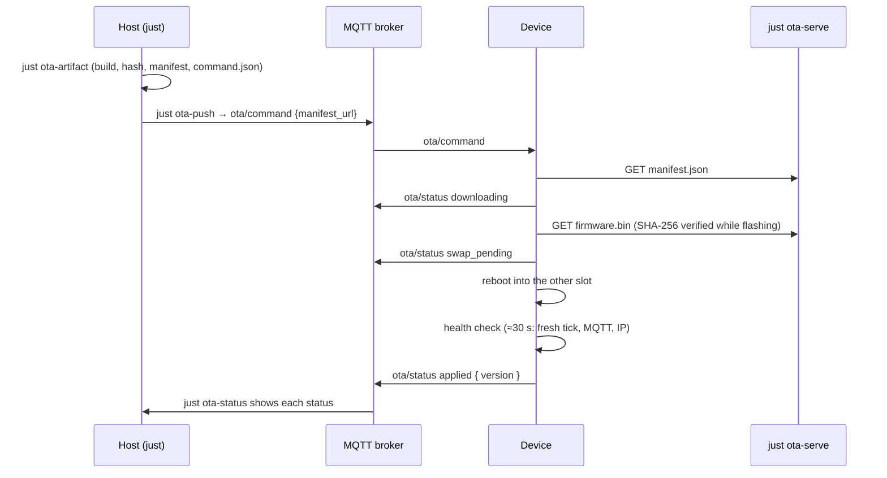
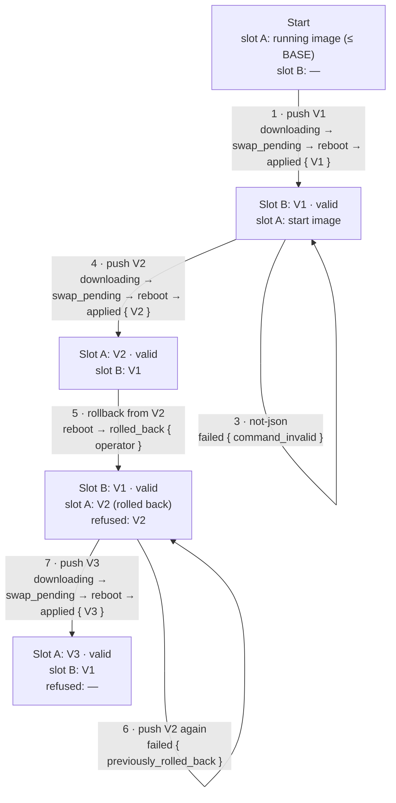

# Runbook: OTA Hardware Test

Run this after any change to the OTA application layer (`src/ota/`), the partition layout, or the network crate, and before a release.
It pushes real updates over MQTT to one device and checks every status on `ota/status`.
Record results in the PR or in the validation section of [`docs/features/ota-mvp-v1.md`](../features/ota-mvp-v1.md), not here.

## Prerequisites

- The device runs the A/B OTA layout (`just flash-baseline <target>` done once, where `<target>` is `idf_c3_rgb_clock` or `idf_c6_rgb_clock`) and is provisioned over SoftAP.
- The device's running image already contains the OTA layer; otherwise serial-flash it once with `just flash <target>`.
- The broker from `.env` (`MQTT_HOST`, `MQTT_PORT`) is reachable, and the shared `tick` publisher is running.
- An MQTT client on `PATH`: the `mqttx` CLI, or `mosquitto_pub`/`mosquitto_sub`; the `just ota-*` recipes use whichever is installed.
- This machine and the device share a LAN; `OTA_HOST` is auto-detected or set in `.env`.

### Fresh start (optional)

Erases the whole chip, including the Wi-Fi/MQTT credentials and every OTA record (attempts, reports, refused version, attempt ids), so the run starts from a known state:

```sh
just flash-baseline idf_c3_rgb_clock
```

Then provision the device over SoftAP again; the `.env` prefill is shared by both chips, so check `MQTT_CLIENT_ID` on the portal before saving.
After the erasure nothing is refused, so `BASE` is the package version from `Cargo.toml` (see the version ladder).
The baseline is built from the working tree, so step 1 then updates new code to new code.
To also test how a newer image adopts the NVS records of an older one, flash the baseline from the previous release instead and let step 1 update it to the code under test.

## Setup

Open three terminals in the repository root; the recipes read the broker (`MQTT_HOST`, `MQTT_PORT`) and `OTA_HOST` from `.env`.

Terminal 1, serial log (idle ticks log at `debug`, so silence between jobs is normal):

```sh
just monitor
```

Terminal 2, status messages:

```sh
just ota-status
```

Terminal 3, artefact server (keep it running for the whole test):

```sh
just ota-serve
```

One push, end to end:



Run every step below from a fourth shell, after setting the variables there.
Every publishing recipe accepts `DRY_RUN=1` to print the command without sending it.

## Version ladder

Every offer must be newer than the running version, and a version that was rolled back is refused afterwards (`failed { previously_rolled_back }`).
So the ladder starts above `BASE`, the **highest version ever offered to this device**, including rolled-back ones, not merely the running one.
The running version is in the serial log line `OTA running version …`; when unsure about older offers, jump ahead (for example `BASE=0.4.0`).

Set the target and `BASE` in the fourth shell, then derive the ladder:

```sh
export TARGET=idf_c3_rgb_clock
export BASE=0.3.6
export V1="${BASE%.*}.$(( ${BASE##*.} + 1 ))" V2="${BASE%.*}.$(( ${BASE##*.} + 2 ))" V3="${BASE%.*}.$(( ${BASE##*.} + 3 ))"
echo "V1=$V1 V2=$V2 V3=$V3"
```

| Name | Used for                                                    |
|:-----|:------------------------------------------------------------|
| `V1` | First update, brings the code under test onto the device    |
| `V2` | Second update, so both slots carry the code under test      |
| `V3` | Update after the refusal, clears the refused-version memory |

`just ota-artifact` bakes the version into the image, so the device reports exactly what the manifest advertises.
Each run also records its manifest URL in `tmp/ota/$TARGET/command.json`, so `just ota-push "$TARGET"` always sends the last artefact staged for that target.
After a completed run, the next run's `BASE` is the last version offered (`$V3`, or the highest optional-scenario version).

## Core sequence

Run the steps in order; each one depends on the device state the previous one left.

| Step | Action                      | Expected on `ota/status`                                              |
|-----:|:----------------------------|:----------------------------------------------------------------------|
|    1 | Push `V1`                   | `downloading`, `swap_pending`, then after the reboot `applied { V1 }` |
|    2 | Push `V1` again             | `failed { up_to_date }`                                               |
|    3 | Publish `not-json`          | `failed { command_invalid }`, ticks keep flowing                      |
|    4 | Push `V2`                   | `downloading`, `swap_pending`, `applied { V2 }`                       |
|    5 | Operator rollback from `V2` | `rolled_back { operator }` from the `V1` boot                         |
|    6 | Push `V2` again             | `failed { previously_rolled_back }`, no download                      |
|    7 | Push `V3`                   | `downloading`, `swap_pending`, `applied { V3 }`                       |

What the device runs after each step; refusals loop back without a reboot:



Slots alternate A → B → A, which is why `V2` comes before the rollback: step 5 needs a previous slot that already carries the code under test.

### Step 1: push V1

```sh
OTA_VERSION="$V1" just ota-artifact "$TARGET"
just ota-push "$TARGET"
```

The serial log shows the download and the restart; the new image logs `[ota] image <V1> is healthy; the slot is marked valid` about 30 s after boot, and only then publishes `applied`.
Wait for `applied` before the next step: an update sent earlier is answered `failed { pending_verify }` once, retained, and applied by itself after `applied`, which skews the step order.

### Steps 2 and 3: refusals

```sh
just ota-push "$TARGET"
just ota-command not-json
```

Neither may restart the device, and the clock must keep tracking `tick`.

### Step 4: push V2

```sh
OTA_VERSION="$V2" just ota-artifact "$TARGET"
just ota-push "$TARGET"
```

Wait for `applied { V2 }`.

### Step 5: operator rollback

```sh
just ota-rollback "$V2"
```

The version must equal the running one, or the command is refused with `failed { version_mismatch }`.
The serial log shows `Rollback to previously worked partition. Restart.`, and the `V1` image publishes `rolled_back { operator, attempt_id, epoch }` about a second after boot.

### Step 6: re-offer V2

`V2` is still the last staged artefact, so pushing again re-offers it:

```sh
just ota-push "$TARGET"
```

Expect `failed { previously_rolled_back }` and no download.

### Step 6b (optional): a failed download keeps the refusal

Stage `V3` truncated, push it, then re-offer `V2`:

```sh
OTA_VERSION="$V3" OTA_TRUNCATE=65536 just ota-artifact "$TARGET"
just ota-push "$TARGET"
OTA_VERSION="$V2" just ota-artifact "$TARGET"
just ota-push "$TARGET"
```

Expect `failed { checksum_mismatch }` and no reboot for `V3`, then still `failed { previously_rolled_back }` for `V2`: only a different version that passes its health check clears the refusal.

### Step 7: push V3

```sh
OTA_VERSION="$V3" just ota-artifact "$TARGET"
just ota-push "$TARGET"
```

Expect `applied { V3 }`; `V3` passing its health check clears the refused-version memory.

<details>
<summary><strong>Optional failure scenarios</strong></summary>

Each needs its own fresh version and leaves the device back on the image it ran before.
Continue the ladder from the core sequence:

```sh
export V4="${BASE%.*}.$(( ${BASE##*.} + 4 ))" V5="${BASE%.*}.$(( ${BASE##*.} + 5 ))" V6="${BASE%.*}.$(( ${BASE##*.} + 6 ))"
echo "V4=$V4 V5=$V5 V6=$V6"
```

Truncated image, expect `failed { checksum_mismatch }` and no reboot:

```sh
OTA_VERSION="$V4" OTA_TRUNCATE=65536 just ota-artifact "$TARGET"
just ota-push "$TARGET"
```

Unhealthy image, expect a restart after about 15 s, then `rolled_back { unhealthy }`:

```sh
OTA_VARIANT=unhealthy OTA_VERSION="$V5" just ota-artifact "$TARGET"
just ota-push "$TARGET"
```

Health deadline, expect `rolled_back { health_deadline }` after about two minutes:

```sh
OTA_TICK_TOPIC="tick-deaf-$TARGET-$V6" OTA_VERSION="$V6" just ota-artifact "$TARGET"
just ota-push "$TARGET"
```

Busy worker: run `just ota-push "$TARGET"` a second time while a download is running; expect `failed { busy }` while the first update completes.

MQTT reconnect: interrupt the device's broker connection mid-session (restart the broker, or block it briefly), then restore it.
Expect the serial log to show the disconnect and a reconnect within about 10 s, the ring to pick up `tick` again, and a following `just ota-push "$TARGET"` to be answered normally.

Deferred offers (`report_pending`, `attempt_unresolved`) cannot be provoked on demand: the push and the rollback report travel through the same broker, so a push only lands while the report can be delivered too.
If one occurs during a run, expect `failed { report_pending }`, then `rolled_back`, then `downloading` for the deferred version without pushing again.

After the truncated scenario the inactive slot is partially overwritten and is no rollback target until the next successful update, so run the operator rollback (step 5) before it, never after.
The deaf image's tick topic carries the target and version, so no real publisher ever feeds it.
The next run's `BASE` is then `$V6`.

</details>

<details>
<summary><strong>Troubleshooting</strong></summary>

| Symptom                                            | Likely cause                                                                                                                                                                                                                                                                                                           |
|:---------------------------------------------------|:-----------------------------------------------------------------------------------------------------------------------------------------------------------------------------------------------------------------------------------------------------------------------------------------------------------------------|
| `failed { pending_verify }`                        | The running image has not marked itself valid yet; an update is retained and applies by itself after `applied`, a rollback must be resent                                                                                                                                                                              |
| `failed { up_to_date }` or `failed { downgrade }`  | The offered version is not newer than the running one; raise `BASE` and re-derive the ladder                                                                                                                                                                                                                           |
| `failed { previously_rolled_back }` outside step 6 | That version was rolled back earlier; raise `BASE` above it and re-derive the ladder                                                                                                                                                                                                                                   |
| `failed { report_pending }`                        | A rollback report is not acknowledged yet; the offer is retained and applied automatically once `rolled_back` is delivered                                                                                                                                                                                             |
| `failed { attempt_unresolved }`                    | An earlier attempt record or an armed rollback request is still open; the offer is retained and applied once it resolves, a reset helps if it stays. If the boot log shows `boot records unusable`, an OTA record is corrupt or unreadable: send `{"action":"repair"}` (answered `repaired`), or `just flash-baseline` |
| `failed { target_mismatch }`                       | The manifest was built for the other chip; check `$TARGET`                                                                                                                                                                                                                                                             |
| `failed { manifest_fetch }`                        | `just ota-serve` is not running, or `OTA_HOST` is not reachable from the device                                                                                                                                                                                                                                        |
| Ring frozen and no `ota/status` replies            | MQTT client deadlock; reset the device and see lore "OTA & Firmware Update"                                                                                                                                                                                                                                            |
| Serial monitor silent after a job                  | Normal when idle; judge liveness by the ring and `ota/status`                                                                                                                                                                                                                                                          |

</details>
